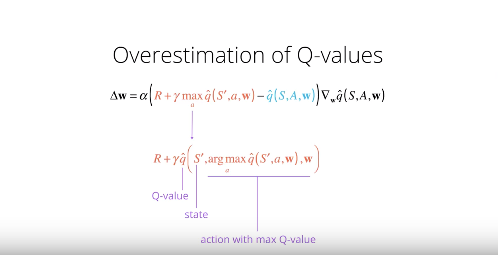

## Deep Reinforcement Learning Nanodegree (Udacity)
## Project 1: Navigation
#### Train a Reinforcement Learning agent with DQN extensions
For this project, I built a reinforcement learning (RL) agent that learns to navigate and collect yellow bananas in a large, square world. 
The world/environment is similar to [Unity's Banana Collector environment](https://github.com/Unity-Technologies/ml-agents/blob/master/docs/Learning-Environment-Examples.md#banana-collector).

#### State
The state space has 37 dimensions and contains the agent's velocity, along with ray-based perception of objects around the agent's forward direction. Given this information, the agent has to learn how to best select actions.

#### Action
Four discrete actions are available:
- `0` move forward
- `1` move backward
- `2` turn left
- `3` turn right

#### Goal
A reward of +1 is provided for collecting a yellow banana, and a reward of -1 is provided for collecting a blue banana. Thus, the goal of your agent is to collect as many yellow bananas as possible while avoiding blue bananas. In order to solve the environment, our agent must achieve an average score of +13 over 100 consecutive episodes.

#### Getting Started
1. Please follow the instructions in the [DRLND GitHub repository](https://github.com/udacity/deep-reinforcement-learning#dependencies) to set up your Python environment. These instructions can be found in README.md at the root of the repository. By following these instructions, you will install PyTorch, the ML-Agents toolkit, and a few more Python packages required to complete the project. Also, the original Udacity repo for this project can be found [here](https://github.com/udacity/deep-reinforcement-learning/tree/master/p1_navigation).

2. Download the environment from one of the links below.  You need only select the environment that matches your operating system:
    - Linux: [click here](https://s3-us-west-1.amazonaws.com/udacity-drlnd/P1/Banana/Banana_Linux.zip)
    - Mac OSX: [click here](https://s3-us-west-1.amazonaws.com/udacity-drlnd/P1/Banana/Banana.app.zip)
    - Windows (32-bit): [click here](https://s3-us-west-1.amazonaws.com/udacity-drlnd/P1/Banana/Banana_Windows_x86.zip)
    - Windows (64-bit): [click here](https://s3-us-west-1.amazonaws.com/udacity-drlnd/P1/Banana/Banana_Windows_x86_64.zip)

    (_For Windows users_) Check out [this link](https://support.microsoft.com/en-us/help/827218/how-to-determine-whether-a-computer-is-running-a-32-bit-version-or-64) if you need help with determining if your computer is running a 32-bit version or 64-bit version of the Windows operating system.

    (_For AWS_) If you'd like to train the agent on AWS (and have not [enabled a virtual screen](https://github.com/Unity-Technologies/ml-agents/blob/master/docs/Training-on-Amazon-Web-Service.md)), then please use [this link](https://s3-us-west-1.amazonaws.com/udacity-drlnd/P1/Banana/Banana_Linux_NoVis.zip) to obtain the environment.

3. Place the file in the DRLND GitHub repository, in the `p1_navigation/` folder, and unzip (or decompress) the file.

#### Running Instruction/Training the Agent
Follow the instructions and run all the cells in Navigation.ipynb to train the agent

#### Approach
The approach here is to pursue a policy that maximizes the reward for the agent. Since the effects of possible actions aren't known in advance, the optimal policy must be discovered by interacting with the environment and recording observations. Therefore, the agent "learns" the policy through a process of trial-and-error that iteratively maps various environment states to the actions that yield the highest reward. This approach or the algorithm is called **Q-Learning**.

For this project, I decided to use **Double Deep Q-Network (DDQN)** and **Dueling DQN**. 

#### Double Deep Q-Network (DDQN)
The issue with the regular Deep Q-Network (DQN) is it can overestimate Q-values ([Thrun & Schwartz, 1993](https://www.ri.cmu.edu/pub_files/pub1/thrun_sebastian_1993_1/thrun_sebastian_1993_1.pdf)). This may be harmful to training performance and sometimes can lead to suboptimal policies. The root cause of this is the max operation in the Bellman equation. As a solution to this problem, the authors proposed modifying the Bellman equation a bit.

We can address the overestimating issue using Double Q-Learning, where one set of parameters `w` is used to select the best action, and another set of parameters `w'` is used to evaluate that action.  

#### Dueling DQN
This improvement was proposed in 2015, in the paper Dueling Network Architectures for Deep Learning [([8] Wang et al., 2015)](https://arxiv.org/pdf/1511.06581.pdf). The paper's contribution was an explicit separation of the value and the advantage in the network's architecture, which brought better training stability, faster convergence and better results on the Atari benchmark. The architecture difference from the classic DQN network is shown on the picture below. The classic DQN network (top) takes features from the convolution layer and, using fully-connected layers, transforms them into a vector of Q-values, one for each action. On the other hand, dueling DQN (bottom) takes convolution features and processes them using two independent paths - one path is responsible for V(s) prediction, which is just a single number, and another path predicts individual advantage values, having the same dimension as Q-values in the classic case. After that, we add V(s) to every value of A(s,a) to obtain the Q(s,a), which is used and trained as normal.

#### Hyperparameters
- Episodes - Ran 1000 episodes for the project submission. Ran more espisodes (2000) during experiments, took longer but the score was not increasing as fast.
- Epsilon - Agent selects action space at random. The value of epsilon starts at 1, and decreases gradually with time until 0.01. Decay set to 0.995.
- Gamma - Kept 0.99 like many of the example exercises.
- Learning rate - set to 0.0005
- TAU (target param) - set to 0.001
- Replay buffer size - set ot 100000
- Bath size kept at 64 like other examples to save memory

#### Plot of Rewards

#### Ideas for Future
*Hyperparameters - Run lot more episodes like, 10,000 or 20,000. If possible, increase buffer size beyond 100,000. Play with learning rate a bit more.
*DQN Extensions - Try other DQN extensions like, Noisy DQN for Exploration and N-step Q-Lerning. The key takeaway Noisy DQN is that parametric noise is added to the weights to induce stochasticity to the agent's policy, yielding more efficient exploration. Regarding N-step Q-Learning, when calculating the target value in Q-Learning, the target value is based on only the current reward. For N-step Q-Learning, rewards from N steps are added together and the Q function value is added only at the very end.
*Prioritized Experienced Replay - Instead of selecting experience tuples randomly, prioritized replay selects experiences based on a priority value that is correlated with the magnitude of error. This can improve learning by increasing the probability that rare and important experience vectors are sampled.
